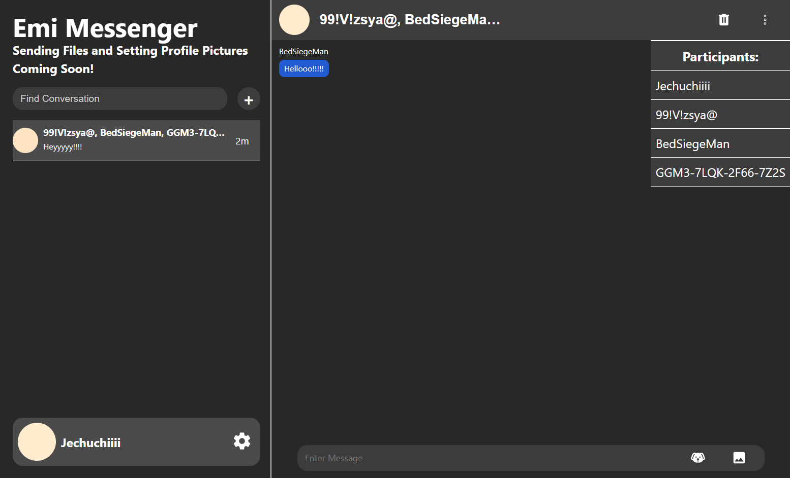
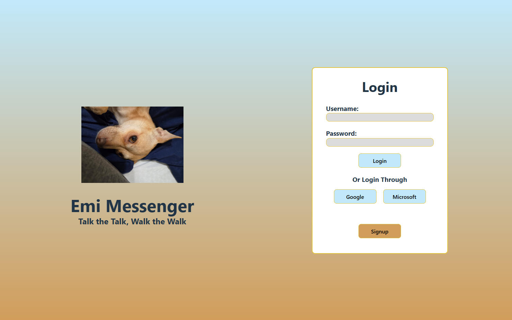

# Emi-Messenger

https://github.com/user-attachments/assets/84792ae8-97b1-4a98-b558-ab0ea0115c1d

## About
This is a real time web based chat application that supports a variety of features:
- 1 to 1 and Group Chats
- No data is held back when deleting
- Deleting a conversation deletes it for all participants of that conversation
- Deleting an account deletes all user data and all conversations a user has been in for all participants in each conversation
- The ability to change username
- Sign in with Google or username and password
- Responsive design (displays nicely from mobile, to tablet, to computer screens)
- online indicators
- recent messages and timestamps

## Goal
The goal of this project is to create a security focused chat application using cloud only E2EE:
- prevents unencrypted data from being stored on user devices (prevents leakage if their device is stolen)
- data is held in a central location that even the application administrator can not view

## Tech Stack
- Languages: TypeScript, HTML/CSS
- Frontend: React.js
- Backend: Express.js
- Database: PostgreSQL
- Caching: Redis
- Real Time Updates: Socket.io

## Get Started
### Prerequisites:
- Have a linux environment (like WSL2 or Ubuntu)
- Have Node.js and npm installed
- have a command terminal (like bash)

### Frontend:
- enter /frontend-ts and run npm install
- create a .env file and copy the .env.example in there, with VITE_API_URL being your api entry point in backend
- run by entering npm run dev (it will not fully work until backend is setup)

### Backend:
- enter /backend-ts and run npm install
- create a .env file and copy .env.example in there
- get and copy the postgres database url into DATABASE_URL from postgres either running on the local machine or a online hosting provider
- run this command twice and put one of each in REFRESH_TOKEN_SECRET and ACCESS_TOKEN_SECRET: openssl rand -base64 32
- put mode either in development for localhost or production if hosting it online
- if hosting in production, enter jwt.ts and in res.cookie, set sameSite: 'none' and domain: 'DOMAIN_YOU_ARE_HOSTING_ON'
- create a OAuth 2.0 Google API Web Key and imput the GOOGLE_CLIENT_ID and GOOGLE_CLIENT_SECRET
- put url of where Redis server is being hosted on
- run by entering npm run dev

## Planned Additions
- Changing email and password
- 2 Factor authentication (email or TOTP)
- typing and read status
- CSRF Tokens
- AWS Hosting

  
App screenshots

  
  

    
    
    
    
    
    
  

