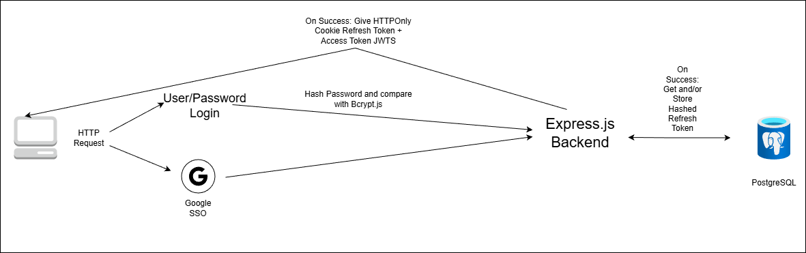
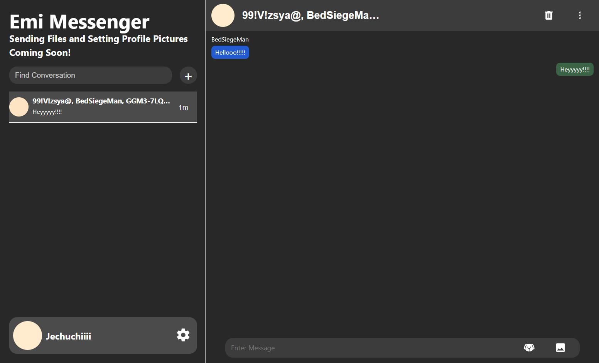
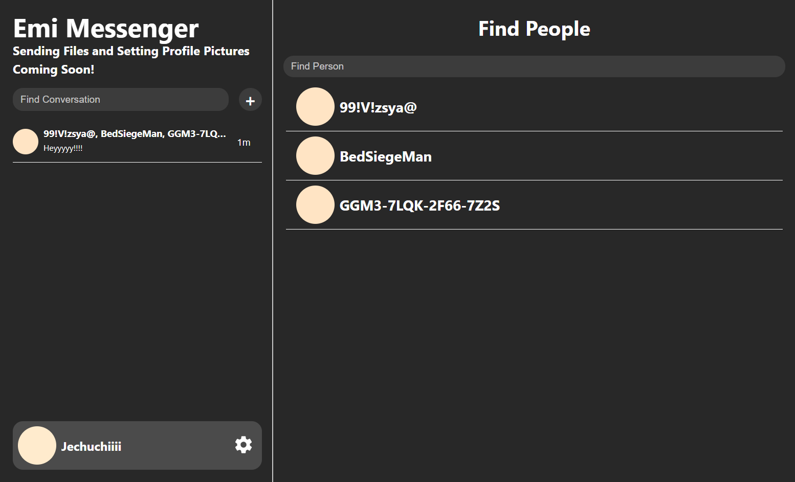
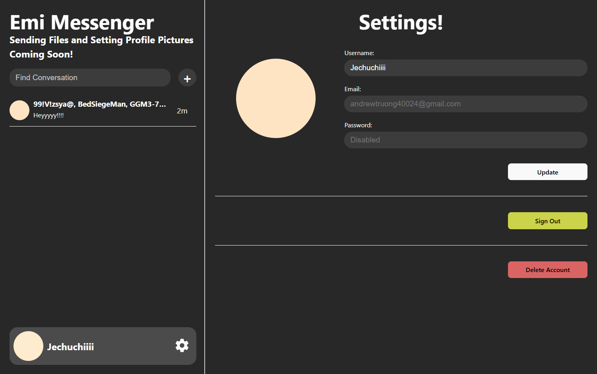
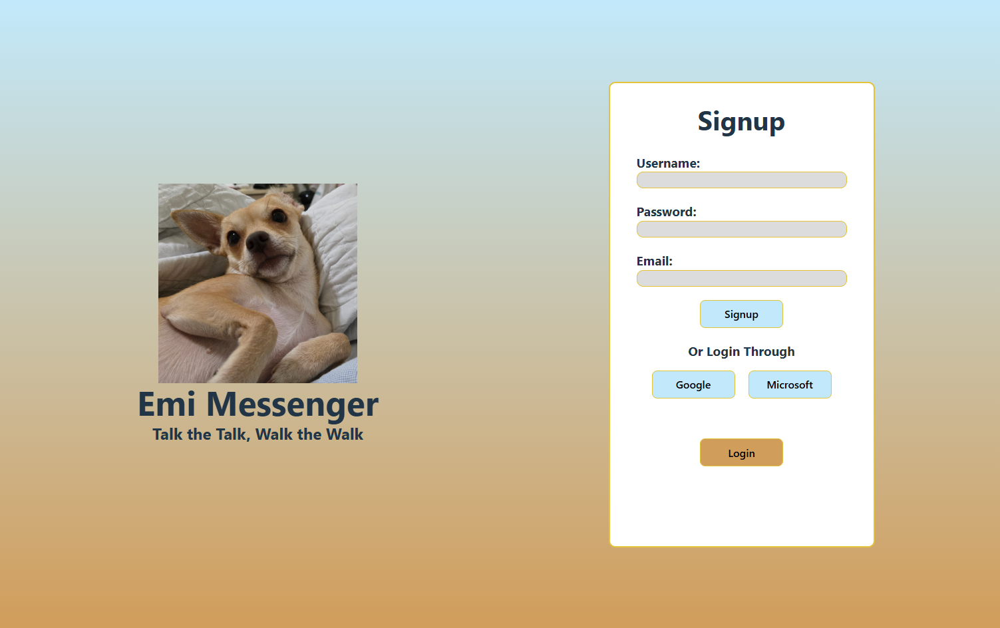
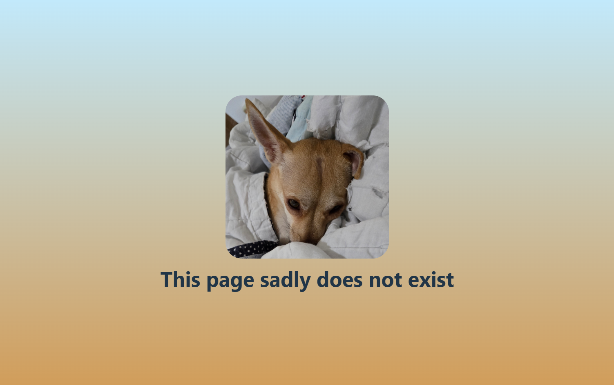

# Emi-Messenger

https://github.com/user-attachments/assets/84792ae8-97b1-4a98-b558-ab0ea0115c1d

## About
This is a real time web based chat application that supports a variety of features:
- 1 to 1 and Group Chats
- No data is held back when deleting
- Deleting a conversation deletes it for all participants of that conversation
- Deleting an account deletes all user data and all conversations a user has been in for all participants in each conversation
- The ability to change username
- Sign in with Google or username and password
- Responsive design (displays nicely from mobile, to tablet, to computer screens)
- online indicators
- recent messages and timestamps

## Goal
The goal of this project is to create a security focused chat application using cloud only E2EE:
- prevents unencrypted data from being stored on user devices (prevents leakage if their device is stolen)
- data is held in a central location that even the application administrator can not view

## Tech Stack
- Languages: TypeScript, HTML/CSS
- Frontend: React.js
- Backend: Express.js
- Database: PostgreSQL with Prisma Object Relational Mapping (ORM)
- Real Time Updates: Socket.io (WebSockets)
- Caching + Socket.io Adapter: Redis
- Containerization: Docker
- Infrastructure: Amazon Web Services (AWS)
- AWS Services
  - Virtual Private Cloud (VPC): Puts ECS, EC2, RDS, Elasticache, and Custom Lambda in an isolated virtual network
  - Cloudfront + S3: Hosting frontend
  - EC2: Hosting backend servers
  - Elastic Container Service (ECS) + Auto Scaling Group (ASG): Horizontal and vertical scaling of EC2 instances
  - Application Load Balancer (ALB): Balances traffic between EC2 Instances, and routes WebSockets
  - RDS: Hosts PostgreSQL
  - Elasticache: Hosts Redis
  - Custom Lambda: Migrating schema structure from Prisma.schema to RDS
  - Secrets Manager: Holds critical secrets like API keys
  - Route 53: Obtaining domain names and managing naming records
  - Code Development Kit (CDK): Cloud infrastructure in code (IaC)

## System Design
### AWS

### Authentication

## Challenges
### Authentication
- Cross Origin Resource Sharing (CORS) Issue
  - Problem: When creating a popup with its origin tied to the frontend for Google Single Sign On (SSO), after successful SSO login, the popup reverts to a frontend page and backend sends the HTTPOnly cookie refresh token and access token, which does not get transferred to the main frontend page.
  - Solution: Instead of using a popup, the frontend page directly loads Google SSO login and after successful SSO login, a backend page is returned that redirects the user to a frontend page with the refresh token attached and the access token attached in the URL hash.   
### React
- UseEffect Issue:
  - Problem: After switching to another conversation, data from previous conversation still exists. This issue is mainly a React component lifecycle issue since I believed the component gets dismounted when switching to another conversation since the url and conversation id changes. 
  - Solution: Create an additional useEffect to clear previous data if the conversation id changes.
- Zustand Issue:
  - Problem: If a user loads directly into a conversation, the messages appear and then quickly disappear. This is due to the messages component setting messages for that conversation in Zustand and then parent home component resetting that store in Zustand. In React, child components load first before parent components.
  - Solution: Delegate message setting purely in the messages component.
### Redis
- Integrating Redis alongside Prisma ORM
  - Redis and PostgreSQL differ in their structure with Redis being purely a NoSQL string based cache store while PostgreSQL is a long term persistent store. Storing methods and retrieval methods differ greatly and they are usually integrated along side with each other: if data exists in Redis, return it but if not, get from PostgreSQL using Prisma ORM and then save that data to Redis. This was difficult to accomplish. 
### AWS
- Lambda Integration to set up RDS Database Schema:
  - Problem: Lambda failing to setup RDS database schema from Prisma ORM due to wrong Dockerfile.migration implementation and architecture mismatch since dockerfiles are built in your local machine.
  - Solution: Make Dockerfile.migration install certain dev dependencies like typescript, tsx (typescript runner), and prisma to be able to run npx prisma commands and in lambda.ts, set architecture to lambda.Architecture.X86_64 for migrationLambda to match my computer's x64 architecture.

## Get Started
### Prerequisites:
- Have a linux environment (like WSL2 or Ubuntu)
- Have Node.js and npm installed
- have a command terminal (like bash)

### Frontend:
- enter /frontend-ts and run npm install
- create a .env file and copy the .env.example in there, with VITE_API_URL being http://localhost:3000/api and VITE_API_DOMAIN being http://localhost:3000/
- run by entering npm run dev (it will not fully work until backend is setup)

### Backend:
- enter /backend-ts and run npm install
- create a .env file and copy .env.example in there
- install any SQL database locally (Postgres, SQLite, MySQL, etc...) or use any SQL provider (Neon, AWS, etc...) and upload the DB environment variables in .env
- run this command twice in linux terminal and put one of each in REFRESH_TOKEN_SECRET and ACCESS_TOKEN_SECRET: openssl rand -base64 32
- put MODE in development
- set ORIGIN to be http://localhost:5173 and BACKEND to be http://localhost:3000
- create a OAuth 2.0 Google API Web Key and input the GOOGLE_CLIENT_ID and GOOGLE_CLIENT_SECRET
- put url and port of where Redis server is being hosted on
- run by entering npm run dev

### AWS (For production):
- IMPORTANT: Will not work on ARM machines, has complicated delete sequence, and costs money. Make sure to run cdk destroy (and look at bottom IMPORTANT) to prevent your account from getting charged when you are done.
- Create or login to an AWS account
- Create an IAM user that has administrator access
- (For new accounts): Set account to Paid, and go to EC2 and run a t3.micro instance for 15 minutes and then delete it to grant full access to AWS.
- Import an existing domain name or buy a domain name in Route 53 in AWS console
- Go to Certificate Manager, request a SSL certificate for *.yourDomainName and yourDomainName (which includes .com or .net for example), and connect it with your domain name.
- enter /infrastructure in the code and set .env where PROD_DOMAIN is the domain name you will be using, CERT_ARN from the SSL certificate in Certificate Manager, and ACCOUNT which will be your AWS account number.
- install AWS CDK cli in your linux terminal, and link your account
- enter /frontend-ts and change VITE_API_URL to https://yourDomainName/api and VITE_API_DOMAIN being https://yourDomainName/
- inside /frontend-ts, run npm run build
- inside /infrastructure, run cdk synth and then cdk deploy
- IMPORTANT: to destroy AWS resources, run cdk destroy, ignore the warnings and delete your ECS instance in AWS console in ECS, and then navigate to EC2 -> auto scaling group and delete that, and in CloudFormation, when retry delete is available, and select retry delete and maintain resources (This will wipe all data within your RDS instance).

## Current Main Issues
- Lambda used for Migration of Prisma schema to RDS returns error to CDK Trigger on successful migration. This causes the lambda to run 2 additional times. This issue does not prevent schema from getting uploaded nor does it stop AWS CDK deployment. 
- cdk destroy does not delete ECS cluster and auto scaling group.
- When a new group chat is created, it does not appear for both the creator and their participants unless they reload their page. 

## Planned Improvements and Additions
- Changing email and password
- 2 Factor authentication (email or TOTP)
- typing and read status
- CSRF Tokens
- E2EE

  
App screenshots

  
  

    
    
    
    
    
    
    
  

